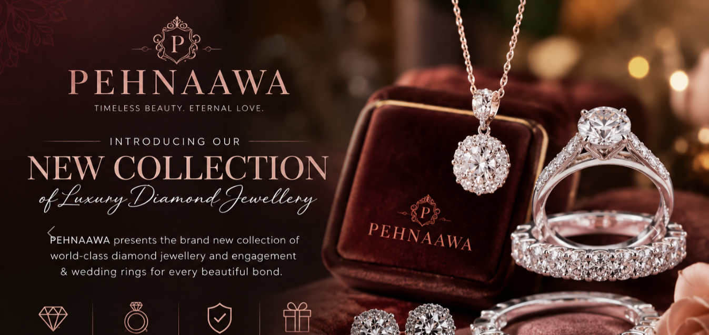
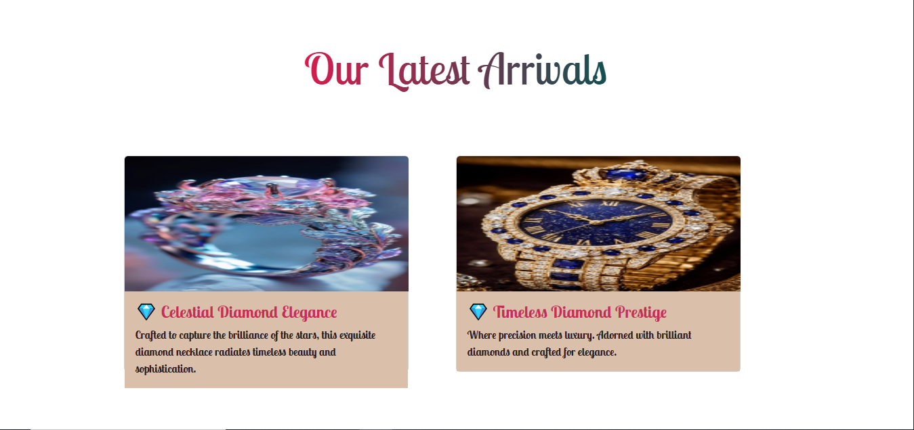
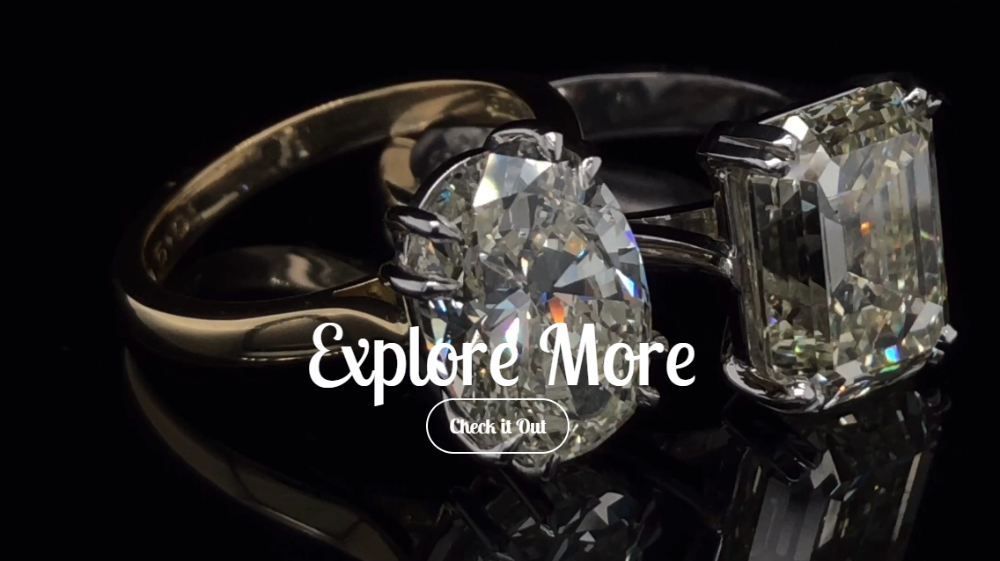
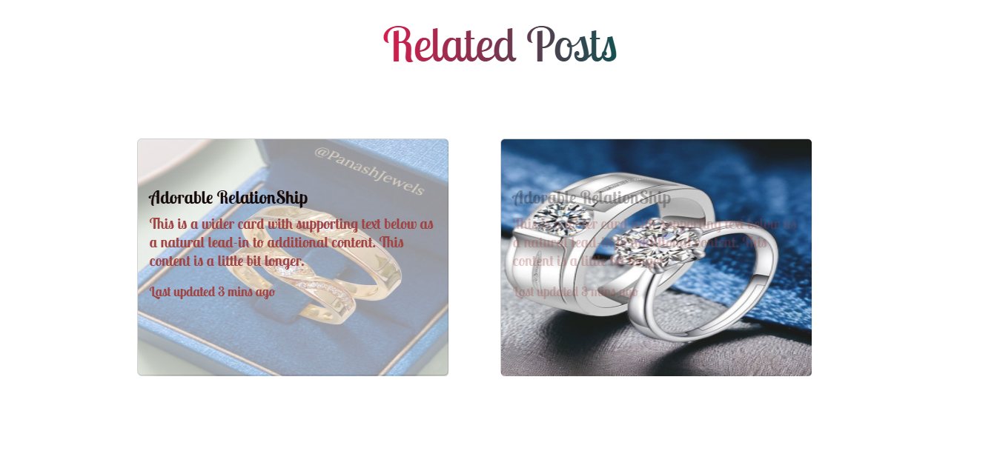
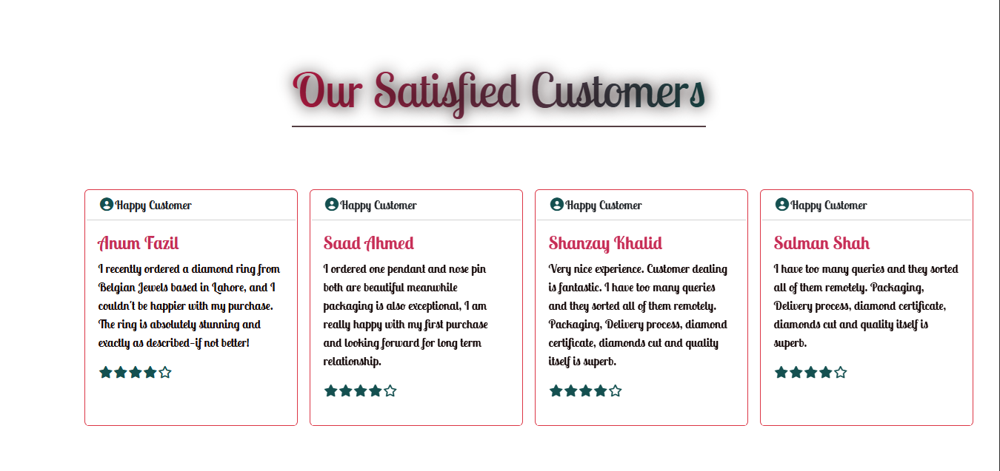
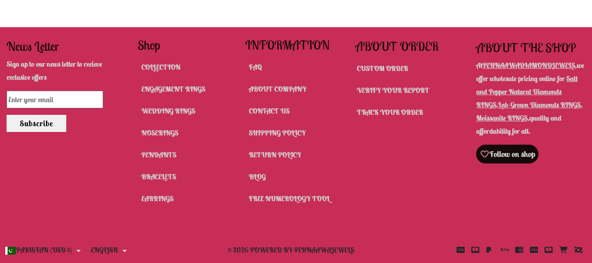

# ✨ PEHNAAWA – Luxury Diamond Jewelry E-Commerce Website | MERN Stack (Bootstrap) Learning Project

I am excited to showcase my newly designed **PEHNAAWA Luxury Diamond Jewelry E-Commerce Website**, a modern and elegant front-end project developed using **HTML5, CSS3, and Bootstrap 5.3**. This project was created to explore how premium jewelry brands present their products through a luxurious digital experience while strengthening my practical skills in responsive web design and front-end development.

The entire website is built using the powerful **Bootstrap 5.3 Framework**, allowing me to create a fully responsive and visually appealing layout that adapts beautifully across desktops, tablets, and mobile devices. Throughout this project, I implemented numerous Bootstrap components and advanced UI techniques to deliver a professional e-commerce experience.

### 💎 Key Features & Functionalities Implemented

🔹 **Responsive Navigation Bar (Navbar)**

* Mobile-friendly Bootstrap Navbar
* Brand-centered logo positioning
* Interactive navigation links
* Search and utility icons

### Image Here 🖼️ 

🔹 **Hero Carousel Section**

* Bootstrap Carousel Component
* Promotional banners for luxury jewelry collections
* Smooth transitions and responsive design

### Image Here 🖼️ 

🔹 **Product Showcase Using Grid System**

* Bootstrap Grid Layout (Rows & Columns)
* Responsive product alignment
* Optimized spacing and visual consistency

🔹 **Luxury Product Cards**

* Elegant Bootstrap Card Components
* Product images, titles, descriptions, and pricing details
* Hover effects for enhanced user engagement

  ### Image Here 🖼️ 

🔹 **Card-Based Collection Sections**

* New Arrivals
* Featured Collections
* Wedding & Engagement Collections
* Related Products

🔹 **Background Video Integration**

* Successfully implemented a **background video section** to create a premium luxury atmosphere
* Improved visual storytelling and user experience
* Added cinematic branding appeal

  ### Image Here 🖼️ 

🔹 **Image Overlay Effects**

* Interactive image overlays
* Text and call-to-action content displayed on hover
* Modern luxury e-commerce aesthetics

### Image Here 🖼️ 

🔹 **Infinite Logo/Image Carousel**

* Implemented an **Infinite Scrolling Carousel** for the first time
* Continuous movement of jewelry collections and brand visuals
* Smooth CSS animations for seamless user interaction

  ### Image Here 🖼️ 

🔹 **Customer Testimonials Section**

* Structured customer review cards
* Trust-building and social proof elements

### Image Here 🖼️ 

🔹 **Professional Footer Design**

* Newsletter subscription form
* Multi-column navigation links
* Contact and company information
* Social media integration

### Image Here 🖼️ 

### 🚀 Skills Strengthened During This Project

* ✔ Bootstrap 5.3 Components
* ✔ Responsive Web Design
* ✔ CSS Flexbox & Grid
* ✔ Bootstrap Grid System
* ✔ Cards & Card Layouts
* ✔ Image Overlay Techniques
* ✔ Background Video Integration
* ✔ Infinite Carousel Animation
* ✔ Mobile-First Development
* ✔ UI/UX Design Principles
* ✔ E-Commerce Front-End Architecture

This project allowed me to combine creativity with technical implementation while designing a luxury jewelry shopping experience. Every section was carefully crafted to reflect the elegance and sophistication associated with premium diamond jewelry brands.

As I continue my journey toward becoming a skilled **Generative AI Engineer and Full-Stack Developer**, projects like **PEHNAAWA** help me strengthen my foundation in modern web development and user experience design.

**If wanna watch a full video of this website then go for this**
Watch here: [YouTube](https://youtu.be/UJPL1OcQNY0)
